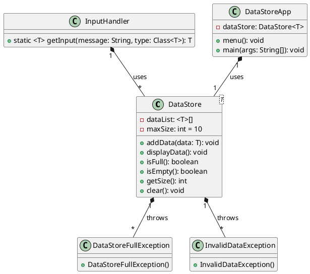

# Actividad 4: Relación de Clases, Excepciones y Genéricos en Java

## Descripción

En esta actividad, implementarás una serie de clases en Java que interactúan entre sí utilizando conceptos de
programación orientada a objetos, manejo de excepciones y clases genéricas. A continuación, se presentan los requisitos
y las instrucciones para completar la actividad.

## Requisitos

1. **Clase Genérica `DataStore<T>`**:
    * Crea una clase genérica llamada `DataStore<T>` que permita almacenar datos de cualquier tipo (por ejemplo,
      Integer, Double, String, etc.).
    * La clase debe de contar con un límite máximo de 10 elementos. Recuerda que puedes definir este límite como una
      constante dentro de la clase.
    * La clase debe tener un atributo privado para almacenar los datos.
    * Implementa un método `addData(T data)` que agregue un dato a la lista. Si la lista alcanza un tamaño máximo de 10
      elementos, lanza una excepción personalizada `DataStoreFullException`.
    * Implementa un método `displayData()` que muestre todos los datos almacenados en la lista o indique que la lista
      está vacía.
    * Implementa un método `isFull()` que retorne `true` si la lista ha alcanzado su tamaño máximo y `false` en caso
      contrario.
    * Implementa un método `isEmpty()` que retorne `true` si la lista está vacía y `false` en caso contrario.
    * Implementa un método `getSize()` que retorne el número actual de elementos en la lista.
    * Implementa un método `clear()` que vacíe la lista de datos.
        * > Recuerda que vaciar no es lo mismo que dejarla en `null`, sino que debes eliminar todos los elementos que
          contiene.{style="warning"}
2. **Excepción Personalizada `DataStoreFullException`**:
    * Crea una clase de excepción personalizada llamada `DataStoreFullException` que extienda de `Exception`.
    * La excepción debe tener un constructor vacio que llame al constructor de la clase base con un mensaje
      predeterminado: "Error: La lista de datos está llena. No se pueden agregar más elementos.".
3. **Enum `MenuOption`**:
    * Crea un enum llamado `MenuOption` con las siguientes opciones:
        * `ADD_ELEMENT("Agregar Elemento")`
        * `DISPLAY_ELEMENTS("Mostrar Elementos")`
        * `CLEAR_LIST("Vaciar Lista")`
        * `EXIT("Salir")`
    * Cada opción debe tener un atributo `description` que almacene la descripción de la opción.
    * Implementa un método `toString()` que retorne la descripción de la opción.
4. **Clase `InputHandler`**:
    * Crea una clase llamada `InputHandler` que contenga un método estático genérico
      `getInput(String message, Class<T> type)` que utilice `JOptionPane` para solicitar al usuario que ingrese un dato
      del tipo especificado.
    * El método debe validar la entrada del usuario y lanzar una excepción personalizada `InvalidDataException` si el
      dato ingresado no corresponde al tipo esperado.
5. **Excepción Personalizada `InvalidDataException`**:
    * Crea una clase de excepción personalizada llamada `InvalidDataException` que extienda de `Exception`.
    * La excepción debe tener un constructor vacío que llame al constructor de la clase base con un mensaje
      predeterminado: "Error: Dato inválido. Por favor, ingrese un dato válido.".
6. **Clase Principal `DataStoreApp`**:
    * Crea una clase principal llamada `DataStoreApp` contenga un atributo `dataStore` de tipo `DataStore<T>`.
    * Implementa el método `menu()` que utilice `JOptionPane` para mostrar un menú con las opciones definidas en el enum
      `MenuOption`.
    * El método `menu()` debe permitir al usuario seleccionar una opción y ejecutar la acción correspondiente:
        * `ADD_ELEMENT`: Solicita al usuario que ingrese un dato utilizando el método `getInput` de la clase
          `InputHandler` y agrega el dato a la lista utilizando el método `addData` de la clase `DataStore`. Maneja las
          excepciones `DataStoreFullException` e `InvalidDataException` para mostrar mensajes de error apropiados al
          usuario.
        * `DISPLAY_ELEMENTS`: Muestra todos los datos almacenados en la lista utilizando el método `displayData` de la
          clase `DataStore`.
        * `CLEAR_LIST`: Vacía la lista de datos utilizando el método `clear` de la clase `DataStore`.
        * `EXIT`: Termina la ejecución del programa.
    * El menú debe repetirse hasta que el usuario seleccione la opción `EXIT`.
7. **Método `main`**:
    * En la clase `DataStoreApp`, implementa el método `main` que inicie la aplicación.
    * El método debe solicitar al usuario que elija el tipo de dato que desea ingresar (Entero o Decimal) utilizando
      `JOptionPane`.
    * Dependiendo de la elección del usuario, crea una instancia de `DataStore<Integer>` o `DataStore<Double>`.
    * Llama al método `menu()` para iniciar la interacción con el usuario.

## Diagrama de Clases

## Instrucciones

1. Implementa todas las clases y métodos descritos en los requisitos.
2. Asegúrate de manejar todas las excepciones adecuadamente y proporcionar mensajes de error claros al usuario.
3. Utiliza `JOptionPane` para todas las interacciones con el usuario.
4. Prueba tu programa para asegurarte de que todas las funcionalidades funcionan correctamente.
5. Documenta tu código con comentarios para explicar la funcionalidad de cada clase y método.

## Entregable

En un solo documento PDF, incluye lo siguiente:

* Portada con los siguientes datos:
    * Nombre del curso
    * Nombre de la actividad
    * Nombre de los integrantes del equipo
* Código fuente de todas las clases implementadas.
* Capturas de pantalla que muestren la ejecución del programa, incluyendo:
    * Menú principal
    * Agregando elementos
    * Mostrando elementos
    * Manejo de excepciones (por ejemplo, intentando agregar un elemento cuando la lista está llena)
    * Vaciar la lista
* Asegúrate de que la portada esté al inicio del documento con los datos solicitados.
* Sube el documento en formato PDF a la plataforma de la asignatura antes de la fecha límite (**_26 de septiembre de
  2025_**).

> Actividades entregadas posteriores a la fecha límite serán consideradas con una calificación máxima de 70/100.
> {style="warning"}

> Integrante que no aparezca en la portada no será considerado en la evaluación de la actividad.
> {style="warning"}

## Criterios de Evaluación

| Criterio             | Descripción                                                          | Peso |
|----------------------|----------------------------------------------------------------------|------|     
| Portada              | Incluye todos los datos requeridos en la portada.                    | 10%  |
| Código Fuente        | Correcta implementación del código fuente para cada clase y método.  | 50%  |
| Capturas de Pantalla | Incluye capturas de pantalla que muestren la ejecución del programa. | 30%  |
| Nombres descriptivos | Uso de nombres descriptivos para variables y métodos.                | 10%  |

> Recuerda que el uso de la clase `JOptionPane` es obligatorio para la interacción con el usuario. De lo contrario se 
> considerará que no se ha cumplido con los requisitos de la actividad.
> {style="warning"}