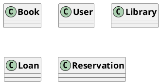
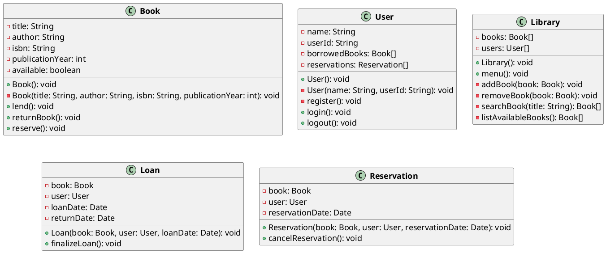
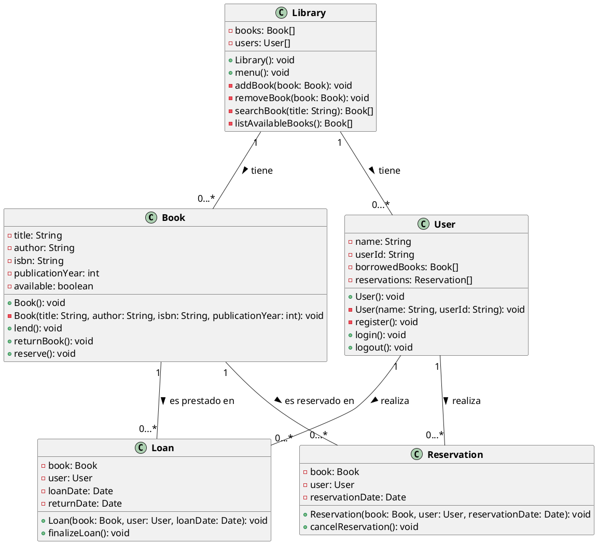

# Ejemplo 1: El sistema de gestión de biblioteca

## Descripción

Un sistema de gestión de biblioteca debe permitir a los usuarios buscar, reservar y prestar libros. El sistema debe
incluir las siguientes clases:

* **Libro**: Representa un libro en la biblioteca. Atributos: título, autor, ISBN, año de publicación, estado (
  disponible, prestado). Métodos: prestar, devolver, reservar.
* **Usuario**: Representa a un usuario de la biblioteca. Atributos: nombre, ID de usuario, lista de libros prestados,
  lista de reservas. Métodos: registrar, iniciar sesión, cerrar sesión.
* **Biblioteca**: Representa la biblioteca en sí. Atributos: lista de libros, lista de usuarios. Métodos:
  agregar libro, eliminar libro, buscar libro, listar libros disponibles.
* **Préstamo**: Representa un préstamo de libro. Atributos: libro, usuario, fecha de préstamo, fecha de devolución.
  Métodos: crear préstamo, finalizar préstamo.
* **Reserva**: Representa una reserva de libro. Atributos: libro, usuario, fecha de reserva. Métodos: crear reserva,
  cancelar reserva.

## Diagrama de Clases

### 1. Identificación de Clases

- Libro(Book)
- Usuario(User)
- Biblioteca(Library)
- Préstamo(Loan)
- Reserva(Reservation)

### 2. Atributos y Métodos

### 3. Relaciones entre Clases

