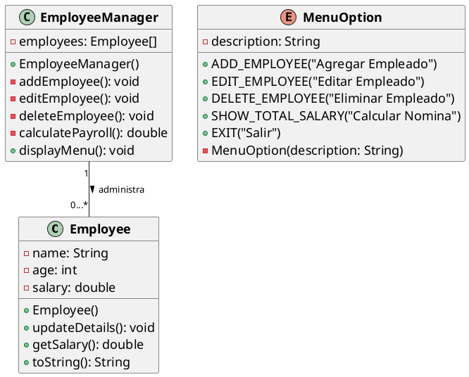

# Ejemplo 2: Leyendo y mostrando datos con JOptionPane

## Descripción

Se requiere un sistema que permite la gestión de empleados de una empresa. El sistema debe permitir ingresar los datos
de los empleados, como nombre, edad y salario. El sistema debe mostrar un menú con las siguientes opciones:

1. Ingresar datos de un empleado.
2. Editar datos de un empleado.
3. Eliminar un empleado.
4. Mostrar el gasto total en salarios.
5. Salir.

Toma en consideración que no debe de existir un límite en la cantidad de empleados en 20.

## Implementación

### Diagrama de Clases

