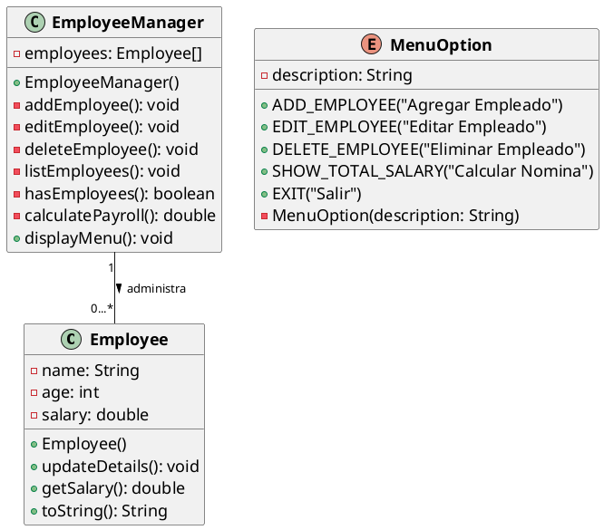

# Ejemplo 2: Leyendo y mostrando datos con JOptionPane

## Descripción

Se requiere un sistema que permite la gestión de empleados de una empresa. El sistema debe permitir ingresar los datos
de los empleados, como nombre, edad y salario. El sistema debe mostrar un menú con las siguientes opciones:

1. Ingresar datos de un empleado.
2. Editar datos de un empleado.
3. Eliminar un empleado.
4. Listar todos los empleados.
5. Mostrar el gasto total en salarios.
6. Salir.

Toma en consideración que no debe de existir un límite en la cantidad de empleados en 20.

## Implementación

### Diagrama de Clases

### Código Java

Una vez que tenemos el diagrama de clases, podemos proceder a implementar el código en Java. A continuación se muestra
una implementación básica del sistema descrito:

### Enum MenuOption

Como se puede notar, el enum `MenuOption` define las opciones del menú con descripciones legibles que se almacenan en
el atributo `description`.

### Clase Employee

La clase `Employee` representa a un empleado con atributos para el nombre(**name**), edad(**age**) y salario(**salary
**).
Incluye métodos para actualizar los detalles del empleado, obtener el salario y representar al empleado como una cadena.

La función `updateDetails` utiliza `JOptionPane` para solicitar al usuario que ingrese o actualice los detalles del
empleado, y muestra en la caja de texto los datos actuales como referencia.

### Clase EmployeeManager

La clase EmployeeManager gestiona una lista dinámica de empleados utilizando un array y métodos para agregar, editar,
eliminar y listar empleados, así como calcular el gasto total en salarios. También incluye un método para mostrar un
menú interactivo utilizando `JOptionPane`.

Ahora analicemos la clase `EmployeeManager` que es la encargada de gestionar los empleados y mostrar el menú.

En primera instancia la función `displayMenu` muestra un menú con las opciones disponibles utilizando `JOptionPane`. El
menú se genera dinámicamente a partir del enum `MenuOption`, lo que facilita la adición o modificación de opciones en el
futuro.

El método `addEmployee` permite agregar un nuevo empleado a la lista. Para ello, primero verifica si hay espacio
disponible en el array, esto recorriendo el mismo hasta encontrar una posición nula. Si hay espacio, crea una nueva
instancia de `Employee`, solicita al usuario que ingrese los detalles del empleado y lo agrega a la lista.

El método `hasEmployees` verifica si hay empleados en la lista, lo que es útil para validar operaciones como editar o
eliminar empleados. Para ello, recorre el array y retorna `true` si encuentra al menos un empleado.

El método `editEmployee` permite editar los detalles de un empleado existente. Primero verifica si hay empleados en la
lista. Si los hay, muestra una lista numerada de empleados y solicita al usuario que seleccione uno para editar. Luego,
llama al método`updateDetails` del empleado seleccionado para actualizar sus detalles.

El método `deleteEmployee` permite eliminar un empleado de la lista. Similar a `editEmployee`, primero verifica si hay
empleados, muestra una lista numerada y solicita al usuario que seleccione uno para eliminar. Luego, establece la
posición del empleado seleccionado en el array a `null`, efectivamente eliminándolo de la lista.

El método `listEmployees` muestra una lista de todos los empleados en la lista. Si no hay empleados, muestra un mensaje
indicando que no hay empleados registrados. Si hay empleados, construye una cadena con los detalles de cada empleado y
la muestra en un cuadro de diálogo.

El método `calculatePayroll` calcula el gasto total en salarios sumando los salarios de todos los empleados en la lista
y muestra el total en un cuadro de diálogo.

Nota como se usan dos formas diferentes de recorrer el array de empleados. En los métodos `hasEmployees` y
`calculatePayroll` se utiliza un bucle `for-each`, que es más conciso y fácil de leer cuando no se necesita el índice
del array. En cambio, en los métodos `editEmployee` y `deleteEmployee`, se utiliza un bucle `for` tradicional, ya que se
necesita el índice para mostrar la lista numerada de empleados y para acceder a un empleado específico en el array.

## Los tipos de JOptionPane

En este ejemplo se han utilizado varios tipos de cuadros de diálogo proporcionados por `JOptionPane`:

- `showInputDialog(String message)`: Muestra un cuadro de diálogo que solicita al usuario que ingrese un valor. Se
  utiliza para ingresar detalles del empleado y seleccionar opciones del menú.
    - Por ejemplo, en el método `updateDetails` de la clase `Employee`, se utiliza para solicitar al usuario que ingrese
      el nombre, edad y salario del empleado de la siguiente manera:
      {style="block"}
- `showMessageDialog(Component parentComponent, Object message)`: Muestra un cuadro de diálogo con un mensaje
  informativo. Se utiliza para mostrar mensajes de error, confirmaciones y listas de empleados.
    - Por ejemplo, en el método `listEmployees` de la clase `EmployeeManager`, se utiliza para mostrar la lista de
      empleados de la siguiente manera:
      {style="block"}
- `showInputDialog(Component parentComponent, Object message, String title, int messageType, Icon icon,
  Object[] selectionValues, Object initialSelectionValue)`: Muestra un cuadro de diálogo con una lista desplegable
  (combo box) para que el usuario seleccione una opción. Se utiliza para mostrar el menú de opciones.
    - Por ejemplo, en el método `displayMenu` de la clase `EmployeeManager`, se utiliza para mostrar el menú de opciones
      de la siguiente manera:
      {style="block"}
    - Aquí, `null` se pasa como `parentComponent` para centrar el cuadro de diálogo en la pantalla, `menu` es el
      mensaje que contiene las opciones del menú, `"Menú de Opciones"` es el título del cuadro de diálogo,
      `JOptionPane.QUESTION_MESSAGE` indica que es un cuadro de diálogo de pregunta, `null` se pasa como `icon` para
      no modificar el icono predeterminado, `options` proporciona las opciones del menú y `options[0]` es la opción
      seleccionada por defecto.