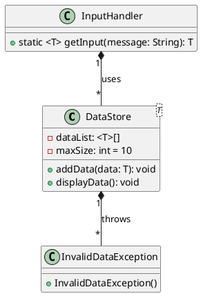

# Ejemplo 3: Lista Genérica con Validación y Manejo de Excepciones

## Descripción

Imagina que queremos hacer un programa donde el usuario capture números enteros o números decimales (dependiendo de lo
que elija), los almacenemos en una lista genérica y validemos que los datos ingresados realmente correspondan al tipo
esperado.

## 💡 Explicación de la idea

* Clase Genérica DataStore<T>
    * Permite guardar datos de cualquier tipo (Integer, Double, String, etc.).
    * La lista cuenta con un límite máximo de 10 elementos.
    * Incluye métodos para agregar datos y validar el tipo.
    * Incluye un método para mostrar los datos guardados.
* Manejo de Excepciones
    * Usaremos try-catch para controlar entradas inválidas (por ejemplo, si el usuario escribe letras en lugar de
      números).
    * Lanzaremos una excepción personalizada InvalidDataException.
* Validación con JOptionPane
    * El usuario elige el tipo de dato (entero o decimal).
    * El programa valida lo ingresado y lo guarda en la lista si es correcto.

## Diagrama de Clases

## Código de Ejemplo

{style="block"}

{style="block"}

{style="block"}