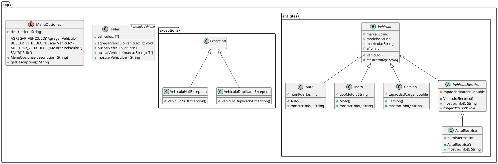

# Ejemplo 6: La Agencia de Vehículos

## Descripción

Imaginemos un sistema para administrar vehículos en un taller mecánico.

Tenemos una clase base  `Vehiculo`, con atributos generales: marca, modelo, año.

Luego tenemos diferentes tipos de vehículos:

* 🚗 Auto (con número de puertas).
* 🏍 Moto (con tipo de motor).
* 🚚 Camion (con capacidad de carga).

Definimos un multinivel: VehiculoElectrico que hereda de Vehiculo y de ahí, AutoElectrico.

Se usará polimorfismo:

* Sobrecarga en el método buscarVehiculo() (por ID o por marca).
* Sobreescritura en el método mostrarInfo().
* Agregación en la clase `Taller<T>` que administra una lista de vehículos.

Con genéricos, el taller podrá administrar distintos tipos de vehículos. Con excepciones, evitaremos registrar un
vehículo null o duplicado. Usaremos un Enum MenuOpciones para las operaciones principales. La interacción será con
JOptionPane.

## Diagrama de Clases

