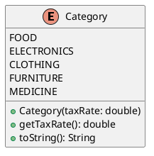
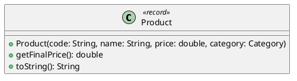
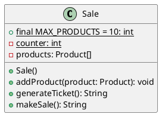
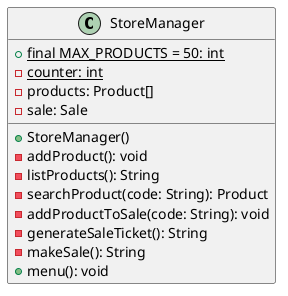
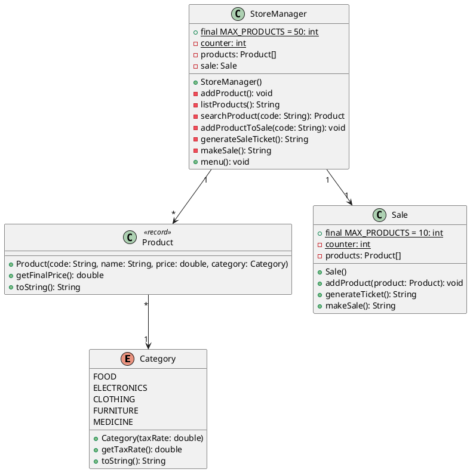

# Ejemplo 6: Gestión de una tienda

## Descripción

En este ejemplo veremos como administrar una tienda de productos, con la posibilidad de agregar productos que pertenecen
a una categoría, teniendo en cuenta que cada categoría tiene un porcentaje de impuesto diferente. Además, se podrá
realizar la venta de productos, generando un ticket con el detalle de la venta y el total a pagar. Teniendo en cuenta
que el total a pagar incluye el impuesto de cada producto y solo poder hacer una venta por vez.

## Modelo de datos

### Categoría

Para el caso de las categorías, se tiene un enumerado con las categorías posibles, las cuales son:

* Comestibles con un impuesto del 10%
* Electrodomésticos con un impuesto del 20%
* Ropa con un impuesto del 15%
* Muebles con un impuesto del 25%
* Medicamentos con un impuesto del 5%

Para el caso de la categoría, se tiene un método que permite obtener el porcentaje de impuestos de la categoría y se
modifica el método `toString` para que muestre el nombre de la categoría y el porcentaje de impuestos.

Por lo que el diagrama de clases para la categoría es el siguiente:



### Producto

Para el caso de los productos, se tiene un código, un nombre, un precio, y una categoría, así como un método que permite
obtener el precio con impuestos del producto, teniendo en cuenta el porcentaje de impuestos de la categoría a la que
pertenece el producto. Además, se modifica el método `toString` para que muestre el código, el nombre, el precio y la
categoría del producto.

Por lo que el diagrama de clases para el producto es el siguiente:



### Venta

Para el caso de las ventas, se tiene una lista de productos, un método que permite agregar un producto a la lista de
productos, un método que permite generar un ticket con el detalle de la venta y el total a pagar, teniendo en cuenta el
precio con impuestos de cada producto, y un método que permite realizar la venta, generando el ticket y vaciando la
lista de productos. Además de un límite de productos por venta de 10 y un contador de productos agregados a la venta.

Por lo que el diagrama de clases para la venta es el siguiente:



### Manager de la tienda

Para el caso del manager de la tienda se tiene lo siguiente:

* Un límite de productos a agregar a la tienda de 50
* Un contador de productos agregados a la tienda
* Una lista de productos en la tienda
* La venta actual
* Un método que permite agregar un producto a la tienda
* Un método que permite listar los productos de la tienda
* Un método que permite buscar un producto por código en la tienda
* Un método que permite agregar un producto a la venta actual
* Un método que permite generar el ticket de la venta actual
* Un método que permite realizar la venta actual
* Un método que permite seleccionar las opciones del menú

Por lo que el diagrama de clases para el manager de la tienda es el siguiente:



## Diagrama de clases

El diagrama de clases para este ejemplo es el siguiente:



## Código fuente

### Category.java

```java
public enum Category {

    FOOD(0.10),
    ELECTRONICS(0.20),
    CLOTHING(0.15),
    FURNITURE(0.25),
    MEDICINE(0.05);

    private final double taxRate;

    Category(double taxRate) {
    
        this.taxRate = taxRate;
    }

    public double getTaxRate() {
    
        return taxRate;
    }

    @Override
    public String toString() {
    
        return "%s (Impuesto: %.2f%%)".formatted(name(), taxRate * 100);
    }
}
```

Como se puede ver, se tiene un enumerado con las categorías posibles, las cuales tienen un porcentaje de impuestos
asociado. Además, se tiene un método que permite obtener el porcentaje de impuestos de la categoría y se modifica el
método `toString` para que muestre el nombre de la categoría y el porcentaje de impuestos.

### Product.java

```java
public record Product(String code, String name, double price, Category category) {

    public double getFinalPrice() {
    
        return price * (1 + category.getTaxRate());
    }

    @Override
    public String toString() {
    
        return "Código: %s, Nombre: %s, Precio: %.2f, Categoría: %s".formatted(code, name, getFinalPrice(), category);
    }
}
```

En este caso se define al producto como un registro que tiene un código, un nombre, un precio y una categoría. Además,
se tiene un método que permite obtener el precio con impuestos del producto, teniendo en cuenta el porcentaje de
impuestos de la categoría a la que pertenece el producto. Se modifica el método `toString` para que muestre el código,
el nombre, el precio y la categoría del producto.

> **Nota**: A partir de Java 16, se puede utilizar la palabra clave `record` para definir un registro, el cual es una
> clase inmutable que se utiliza para modelar datos. En este caso, se utiliza para definir la clase `Product`, ya que el
> mismo no puede ser modificado una vez creado.

### Sale.java

```java
public class Sale {

    public static final int MAX_PRODUCTS = 10;
    private static int counter = 0;
    private final Product[] products = new Product[MAX_PRODUCTS];

    public void addProduct(Product product) throws IllegalStateException {
    
        if (counter < MAX_PRODUCTS) {
        
            products[counter++] = product;
        }else{
            trhow new IllegalStateException("No se pueden agregar más productos a la venta");
        }
    }

    public String generateTicket() {
    
        StringBuilder builder = new StringBuilder();
        Product product;
        double total = 0;
        
        if (counter == 0) {
        
            return "No hay productos en la venta";
        }

        for (int i = 0; i < counter; i++) {
        
            product = products[i];
            builder.append(product).append("\n");
            total += product.getFinalPrice();
        }

        builder.append("Total a pagar: %.2f".formatted(total));
        return builder.toString();
    }

    public String makeSale() {
    
        var ticket = generateTicket();
        counter = 0;
        return ticket;
    }
}
```

En este caso se tiene una clase que representa una venta, la cual tiene una lista de productos y un conjunto de
funciones que se describen a continuación:

* `addProduct(Product product)`: Permite agregar un producto a la lista de productos de la venta, teniendo en cuenta el
  límite de productos por venta. En caso de que se intente agregar un producto y se haya alcanzado el límite, se lanza
  una excepción.
* `generateTicket()`: Permite generar un ticket con el detalle de la venta y el total a pagar, teniendo en cuenta el
  precio con impuestos de cada producto.
* `makeSale()`: Permite realizar la venta, generando el ticket y vaciando la lista de productos.
* `MAX_PRODUCTS`: Constante que define el límite de productos por venta.
* `counter`: Contador de productos agregados a la venta.
* `products`: Lista de productos de la venta.

### MenuOption.java

Se agrega un enumerado con las opciones del menú para el manager de la tienda. Esto para facilitar la selección de las
opciones del menú.

```java
public enum MenuOption {

    ADD_PRODUCT("Agregar producto"),
    LIST_PRODUCTS("Listar productos"),
    SEARCH_PRODUCT("Buscar producto"),
    ADD_PRODUCT_TO_SALE("Agregar producto a la venta"),
    GENERATE_SALE_TICKET("Generar ticket de venta"),
    MAKE_SALE("Realizar venta"),
    EXIT("Salir");

    private final String description;

    MenuOption(String description) {
    
        this.description = description;
    }

    @Override
    public String toString() {
    
        return "%d. %s".formatted(ordinal() + 1, description);
    }
}
```

### StoreManager.java

Para esta clase tomaremos en consideración la librería de validación genérica que se encuentra en el paquete
`org.tec.utils`.

```java
import javax.swing.JOptionPane;

import org.tec.utils.Validator;

public class StoreManager {

    public static final int MAX_PRODUCTS = 50;
    private static int counter = 0;
    private final Product[] products = new Product[MAX_PRODUCTS];
    private final Sale sale = new Sale();

    public StoreManager() {

        menu();
    }

    private void addProduct() {

        if (counter < MAX_PRODUCTS) {

            String code = Validator.validate(String.class, "Ingrese el código del producto", "Código inválido"
            );
            String name = Validator.validate(String.class, "Ingrese el nombre del producto", "Nombre inválido"
            );
            double price = Validator.validate(Double.class, (Double d) -> d > 0.0, "Ingrese el precio del producto", "Precio inválido",
                    "Nuevo Producto");
            Category category = (Category) Validator.validate(Category.values(), "Seleccione la categoría del producto",
                    "Categoría inválida", "Nuevo Producto");
            products[counter++] = new Product(code, name, price, category);
            JOptionPane.showMessageDialog(null, "Producto agregado a la tienda", "Nuevo Producto",
                    JOptionPane.INFORMATION_MESSAGE);
        } else {
            JOptionPane.showMessageDialog(null, "No se pueden agregar más productos a la tienda", "Error",
                    JOptionPane.ERROR_MESSAGE);
        }
    }

    private String listProducts() {

        StringBuilder builder = new StringBuilder();
        Product product;

        if (counter == 0) {

            return "No hay productos en la tienda";
        }

        for (Product product : products) {

            builder.append(product).append("\n");
        }

        return builder.toString();
    }

    private Product searchProduct(String code) {

        Product product;

        for (Product product : products) {

            if (product.code().equals(code)) {

                return product;
            }
        }

        return null;
    }

    private void addProductToSale() {

        try {

            String code = Validator.validate(String.class, "Ingrese el código del producto", "Código inválido");
            Product product = searchProduct(code);
            if (product == null) {

                JOptionPane.showMessageDialog(null, "Producto no encontrado", "Venta", JOptionPane.ERROR_MESSAGE);
                return;
            }
            sale.addProduct(product);
            JOptionPane.showMessageDialog(null, "Producto agregado a la venta", "Venta", JOptionPane.INFORMATION_MESSAGE);
        } catch (IllegalStateException e) {

            JOptionPane.showMessageDialog(null, e.getMessage(), "Venta", JOptionPane.ERROR_MESSAGE);
        }
    }

    private String generateSaleTicket() {

        return sale.generateTicket();
    }

    private String makeSale() {

        return sale.makeSale();
    }

    public void menu() {

        MenuOption selectedOption = Validator.validate(MenuOption.values(), "Seleccione una opción", "Opción inválida", "Menú");

        switch (selectedOption) {
            case ADD_PRODUCT -> addProduct();
            case LIST_PRODUCTS ->
                    JOptionPane.showMessageDialog(null, listProducts(), "Productos en la tienda", JOptionPane.INFORMATION_MESSAGE);
            case SEARCH_PRODUCT -> {
                String code = Validator.validate(String.class, "Ingrese el código del producto", "Código inválido");
                Product product = searchProduct(code);
                JOptionPane.showMessageDialog(null, product != null ? product : "Producto no encontrado", "Buscar Producto", JOptionPane.INFORMATION_MESSAGE);
            }
            case ADD_PRODUCT_TO_SALE -> addProductToSale();
            case GENERATE_SALE_TICKET ->
                    JOptionPane.showMessageDialog(null, generateSaleTicket(), "Ticket de Venta", JOptionPane.INFORMATION_MESSAGE);
            case MAKE_SALE ->
                    JOptionPane.showMessageDialog(null, makeSale(), "Venta Realizada", JOptionPane.INFORMATION_MESSAGE);
            case EXIT -> {
                JOptionPane.showMessageDialog(null, "Saliendo de la aplicación", "Salir", JOptionPane.INFORMATION_MESSAGE);
                System.exit(0);
            }
        }
    }
```

En este caso se tiene una clase que representa el manager de la tienda, la cual tiene un conjunto de funciones que se
describen a continuación:

* `addProduct()`: Permite agregar un producto a la tienda, teniendo en cuenta el límite de productos en la tienda. En
  caso de que se intente agregar un producto y se haya alcanzado el límite, se muestra un mensaje de error.
* `listProducts()`: Permite listar los productos de la tienda.
* `searchProduct(String code)`: Permite buscar un producto por código en la tienda.
* `addProductToSale()`: Permite agregar un producto de la lista de productos de la tienda a la venta actual. En caso de
  que la venta esté llena, se muestra un mensaje de error.
* `generateSaleTicket()`: Permite generar el ticket de la venta actual.
* `makeSale()`: Permite realizar la venta actual, generando el ticket y vaciando la lista de productos de la venta.
* `menu()`: Permite seleccionar las opciones del menú y ejecutar la acción correspondiente.

### Main.java

```java
public class Main {

    public static void main(String[] args) {
    
        new StoreManager();
    }
}
```

En este caso se tiene una clase principal que se encarga de iniciar la aplicación, creando una instancia del manager de
la tienda.

## Conclusión

En este ejemplo se ha mostrado como administrar una tienda de productos, con la posibilidad de agregar productos que
pertenecen a una categoría, teniendo en cuenta que cada categoría tiene un porcentaje de impuesto diferente. Además, se
puede realizar la venta de productos, generando un ticket con el detalle de la venta y el total a pagar, teniendo en
cuenta el total a pagar incluye el impuesto de cada producto y solo poder hacer una venta por vez.