# Ejemplo 7: Calculadora de áreas y perímetros de figuras geométricas

## Descripción

Este programa permite calcular el área y perímetro de figuras geométricas de la siguiente lista:

* Cuadrado
* Rectángulo
* Triángulo
* Círculo
* Trapecio
* Rombo
* Romboide
* Polígono regular
* Elipse

## Requerimientos

El sistema deberá ser realizado en Java y deberá contar con una interfaz gráfica que permita al usuario seleccionar la
figura geométrica de la que desea calcular el área y perímetro, y que le solicite los datos necesarios para realizar los
cálculos.

## Restricciones

El sistema deberá validar que los datos ingresados por el usuario sean válidos y que cumplan con las restricciones de
cada figura geométrica. Podemos usar nuestra clase de validación de datos `org.tec.utils.Validator`.

## Diagrama de clases

A continuación se muestra el diagrama de clases del sistema:

```plantuml
@startuml

abstract class GeometricFigure {
    #name: String
    +GeometricFigure(name: String)
    +abstract calculateArea(): double
    +abstract calculatePerimeter(): double
}

class Square extends GeometricFigure {
    -side: double
    +Square(side: double)
    +calculateArea(): double
    +calculatePerimeter(): double
}

class Rectangle extends GeometricFigure {
    -width: double
    -height: double
    +Rectangle(width: double, height: double)
    +calculateArea(): double
    +calculatePerimeter(): double
}

class Triangle extends GeometricFigure {
    -side1: double
    -side2: double
    -side3: double
    +Triangle(side1: double, side2: double, side3: double)
    +calculateArea(): double
    +calculatePerimeter(): double
}

class Circle extends GeometricFigure {
    -radius: double
    +Circle(radius: double)
    +calculateArea(): double
    +calculatePerimeter(): double
}

class Trapezoid extends GeometricFigure {
    -base1: double
    -base2: double
    -height: double
    +Trapezoid(base1: double, base2: double, height: double)
    +calculateArea(): double
    +calculatePerimeter(): double
}

class Rhombus extends GeometricFigure {
    -side: double
    -diagonal1: double
    -diagonal2: double
    +Rhombus(side: double, diagonal1: double, diagonal2: double)
    +calculateArea(): double
    +calculatePerimeter(): double
}

class Rhomboid extends GeometricFigure {
    -base: double
    -height: double
    -side: double
    +Rhomboid(base: double, height: double, side: double)
    +calculateArea(): double
    +calculatePerimeter(): double
}

class RegularPolygon extends GeometricFigure {
    -side: double
    -numberOfSides: int
    -apothem: double
    +RegularPolygon(side: double, numberOfSides: int)
    +calculateArea(): double
    +calculatePerimeter(): double
}

class Ellipse extends GeometricFigure {
    -semiMajorAxis: double
    -semiMinorAxis: double
    +Ellipse(semiMajorAxis: double, semiMinorAxis: double)
    +calculateArea(): double
    +calculatePerimeter(): double
}

enum GeometricFigureType {
    SQUARE
    RECTANGLE
    TRIANGLE
    CIRCLE
    TRAPEZOID
    RHOMBUS
    RHOMBOID
    REGULAR_POLYGON
    ELLIPSE
}

class ShapeCalculator {
    +menu(): void
    -getGeometricFigure(): GeometricFigure
    -calculateData(figure: GeometricFigure): void
}

@enduml
```



## Solución

### GeometricFigure.java

```java
package org.tec.geometric;

public abstract class GeometricFigure {
    private String name;

    public GeometricFigure(String name) {
        this.name = name;
    }

    public abstract double calculateArea();

    public abstract double calculatePerimeter();
}
```

### Square.java

```java
package org.tec.geometric;

public class Square extends GeometricFigure {
    private double side;

    public Square(double side) {
        super("Square");
        this.side = side;
    }

    @Override
    public double calculateArea() {
        return side * side;
    }

    @Override
    public double calculatePerimeter() {
        return 4 * side;
    }
}
```

### Rectangle.java

```java
package org.tec.geometric;

public class Rectangle extends GeometricFigure {
    private double width;
    private double height;

    public Rectangle(double width, double height) {
        super("Rectangle");
        this.width = width;
        this.height = height;
    }

    @Override
    public double calculateArea() {
        return width * height;
    }

    @Override
    public double calculatePerimeter() {
        return 2 * (width + height);
    }
}
```

### Triangle.java

```java
package org.tec.geometric;

public class Triangle extends GeometricFigure {
    private double side1;
    private double side2;
    private double side3;

    public Triangle(double side1, double side2, double side3) {
        super("Triangle");
        this.side1 = side1;
        this.side2 = side2;
        this.side3 = side3;
    }

    @Override
    public double calculateArea() {
        double s = (side1 + side2 + side3) / 2;
        return Math.sqrt(s * (s - side1) * (s - side2) * (s - side3));
    }

    @Override
    public double calculatePerimeter() {
        return side1 + side2 + side3;
    }
}
```

### Circle.java

```java
package org.tec.geometric;

public class Circle extends GeometricFigure {
    private double radius;

    public Circle(double radius) {
        super("Circle");
        this.radius = radius;
    }

    @Override
    public double calculateArea() {
        return Math.PI * radius * radius;
    }

    @Override
    public double calculatePerimeter() {
        return 2 * Math.PI * radius;
    }
}
```

### Trapezoid.java

```java
package org.tec.geometric;

public class Trapezoid extends GeometricFigure {
    private double base1;
    private double base2;
    private double height;

    public Trapezoid(double base1, double base2, double height) {
        super("Trapezoid");
        this.base1 = base1;
        this.base2 = base2;
        this.height = height;
    }

    @Override
    public double calculateArea() {
        return (base1 + base2) * height / 2;
    }

    @Override
    public double calculatePerimeter() {
        return base1 + base2 + 2 * Math.sqrt(Math.pow((base2 - base1) / 2, 2) + Math.pow(height, 2));
    }
}
```

### Rhombus.java

```java
package org.tec.geometric;

public class Rhombus extends GeometricFigure {
    private double side;
    private double diagonal1;
    private double diagonal2;

    public Rhombus(double side, double diagonal1, double diagonal2) {
        super("Rhombus");
        this.side = side;
        this.diagonal1 = diagonal1;
        this.diagonal2 = diagonal2;
    }

    @Override
    public double calculateArea() {
        return (diagonal1 * diagonal2) / 2;
    }

    @Override
    public double calculatePerimeter() {
        return 4 * side;
    }
}
```

### Rhomboid.java

```java
package org.tec.geometric;

public class Rhomboid extends GeometricFigure {
    private double base;
    private double height;
    private double side;

    public Rhomboid(double base, double height, double side) {
        super("Rhomboid");
        this.base = base;
        this.height = height;
        this.side = side;
    }

    @Override
    public double calculateArea() {
        return base * height;
    }

    @Override
    public double calculatePerimeter() {
        return 2 * (base + side);
    }
}
```

### RegularPolygon.java

```java
package org.tec.geometric;

public class RegularPolygon extends GeometricFigure {
    private double side;
    private int numberOfSides;
    private double apothem;

    public RegularPolygon(double side, int numberOfSides) {
        super("Regular Polygon");
        this.side = side;
        this.numberOfSides = numberOfSides;
        this.apothem = side / (2 * Math.tan(Math.PI / numberOfSides));
    }

    @Override
    public double calculateArea() {
        return (numberOfSides * side * apothem) / 2;
    }

    @Override
    public double calculatePerimeter() {
        return numberOfSides * side;
    }
}
```

### Ellipse.java

```java
package org.tec.geometric;

public class Ellipse extends GeometricFigure {
    private double semiMajorAxis;
    private double semiMinorAxis;

    public Ellipse(double semiMajorAxis, double semiMinorAxis) {
        super("Ellipse");
        this.semiMajorAxis = semiMajorAxis;
        this.semiMinorAxis = semiMinorAxis;
    }

    @Override
    public double calculateArea() {
        return Math.PI * semiMajorAxis * semiMinorAxis;
    }

    @Override
    public double calculatePerimeter() {
        return 2 * Math.PI * Math.sqrt((Math.pow(semiMajorAxis, 2) + Math.pow(semiMinorAxis, 2)) / 2);
    }
}
```