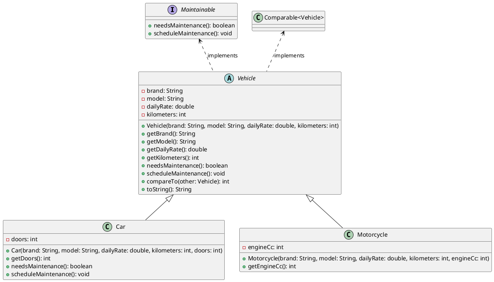

# Ejemplo 8: La agencia EasyRent

La agencia EasyRent mantiene una lista dinámica de vehículos. Necesitamos:

* Registrar y gestionar vehículos en un ArrayList.
* Filtrar vehículos según reglas (ej. dailyRate > X) usando interfaces funcionales.
* Ordenarlos por tarifa diaria y convertir la lista a un arreglo (Vehicle[]) para enviarlo a una API que solo acepta
  arrays (aquí usamos Arrays).
* Programar mantenimientos con una interfaz no funcional (Maintainable) que obliga a implementar dos métodos (ej.
  needsMaintenance() y scheduleMaintenance()), mostrando una diferencia con las interfaces funcionales.

> Metáfora: el ArrayList es una bandeja que crece conforme entran más platos; Arrays nos ayuda a pasar esos platos a una
> caja rígida (array) que algunas máquinas aún requieren.
> {style="note"}

## Diagrama de clases



## Código de ejemplo

### Maintainable.java

```java
public interface Maintainable {
    boolean needsMaintenance();      // abstract method 1

    void scheduleMaintenance();      // abstract method 2
}
```

### Vehicle.java

```java
public abstract class Vehicle implements Maintainable, Comparable<Vehicle> {
    protected String brand;
    protected String model;
    protected double dailyRate;
    protected int kilometers; // example field used by maintenance rule

    public Vehicle(String brand, String model, double dailyRate, int kilometers) {
        this.brand = brand;
        this.model = model;
        this.dailyRate = dailyRate;
        this.kilometers = kilometers;
    }

    public String getBrand() {
        return brand;
    }

    public String getModel() {
        return model;
    }

    public double getDailyRate() {
        return dailyRate;
    }

    public int getKilometers() {
        return kilometers;
    }

    // Maintainable interface methods (to be implemented by subclasses or here)
    @Override
    public boolean needsMaintenance() {
        // default rule: maintenance every 10000 km
        return this.kilometers >= 10000;
    }

    @Override
    public void scheduleMaintenance() {
        System.out.println("Scheduling maintenance for: " + brand + " " + model);
        // in real app: add to maintenance calendar
    }

    @Override
    public int compareTo(Vehicle other) {
        // Natural ordering by dailyRate ascending
        return Double.compare(this.dailyRate, other.dailyRate);
    }

    @Override
    public String toString() {
        return String.format("%s %s - $%.2f/day - %d km", brand, model, dailyRate, kilometers);
    }
}
```

### Car.java

```java
public class Car extends Vehicle {
    private int doors;

    public Car(String brand, String model, double dailyRate, int kilometers, int doors) {
        super(brand, model, dailyRate, kilometers);
        this.doors = doors;
    }

    public int getDoors() {
        return doors;
    }

    // override maintenance rule for cars (example)
    @Override
    public boolean needsMaintenance() {
        // heavy rule: car needs maintenance if >= 12000 km
        return this.kilometers >= 12000;
    }

    @Override
    public void scheduleMaintenance() {
        System.out.println("Car maintenance scheduled for " + brand + " " + model);
    }
}
```

### Motorcycle.java

```java
public class Motorcycle extends Vehicle {
    private int engineCc;

    public Motorcycle(String brand, String model, double dailyRate, int kilometers, int engineCc) {
        super(brand, model, dailyRate, kilometers);
        this.engineCc = engineCc;
    }

    public int getEngineCc() {
        return engineCc;
    }

    // Keep default maintenance rule from Vehicle
}
```

### Notas Importantes

* `Maintainable` tiene dos métodos: es no funcional (no apta para lambdas).
* `Vehicle` implementa `Comparable<Vehicle>` (permite orden natural por dailyRate).
* `needsMaintenance()` en `Car` está sobrescrito (polimorfismo).

### Main.java

```java
// File: Main.java

import java.util.*;
import java.util.function.*;

public class Main {
    public static void main(String[] args) {
        // 1. Crear un ArrayList dinámico
        List<Vehicle> fleet = new ArrayList<>();

        // 2. Agregar vehículos (dynamic growth)
        fleet.add(new Car("Toyota", "Corolla", 50.0, 9000, 4));
        fleet.add(new Motorcycle("Yamaha", "MT-07", 30.0, 15000, 689));
        fleet.add(new Car("BMW", "Series3", 120.0, 13000, 4));
        fleet.add(new Motorcycle("Honda", "CBR500R", 40.0, 8000, 471));
        fleet.add(new Car("Renault", "Kwid", 25.0, 4000, 4));

        // 3. Interfaces funcionales: Predicate, Function, Consumer
        Predicate<Vehicle> expensive = v -> v.getDailyRate() >= 50.0;
        Function<Vehicle, String> toDisplayString = v -> String.format("%s %s - $%.2f", v.getBrand(), v.getModel(), v.getDailyRate());
        Consumer<String> printer = s -> System.out.println(">> " + s);

        // 4. Filtrar con Predicate y mostrar con Function + Consumer
        System.out.println("Expensive vehicles (>= $50/day):");
        fleet.stream()
                .filter(expensive)
                .map(toDisplayString)
                .forEach(printer);

        // 5. Detectar y programar mantenimientos (interface non-functional methods)
        System.out.println("\nVehicles needing maintenance:");
        for (Vehicle v : fleet) {
            if (v.needsMaintenance()) {
                System.out.println(v + " -> needs maintenance");
                v.scheduleMaintenance(); // non-functional interface usage
            }
        }

        // 6. Ordenar la lista (uses Comparable implemented in Vehicle)
        Collections.sort(fleet); // sorts by dailyRate via compareTo
        System.out.println("\nFleet sorted by daily rate (ascending):");
        fleet.forEach(v -> System.out.println(v));

        // 7. Convertir ArrayList a array usando toArray, luego usar Arrays methods
        Vehicle[] fleetArray = fleet.toArray(new Vehicle[0]); // convert to Vehicle[]
        System.out.println("\nArray created from ArrayList (length = " + fleetArray.length + ")");

        // 8. Use Arrays.copyOf to create a larger array (simulate old API space)
        Vehicle[] bigger = Arrays.copyOf(fleetArray, fleetArray.length + 2);
        System.out.println("Copied to bigger array (length = " + bigger.length + ")");

        // 9. Arrays.sort with a custom comparator (sort by kilometers descending)
        Arrays.sort(fleetArray, Comparator.comparingInt(Vehicle::getKilometers).reversed());
        System.out.println("\nFleet array sorted by kilometers (descending):");
        for (Vehicle v : fleetArray) {
            System.out.println(v);
        }

        // 10. Arrays.asList to get a fixed-size list view (careful: cannot add/remove)
        List<Vehicle> fixedView = Arrays.asList(fleetArray);
        System.out.println("\nFixed-size list view via Arrays.asList (size = " + fixedView.size() + ")");
        // fixedView.add(...); // would throw UnsupportedOperationException

        // 11. Example: using Arrays.fill on an array of Strings
        String[] notes = new String[3];
        Arrays.fill(notes, "No note");
        System.out.println("\nNotes array filled:");
        System.out.println(Arrays.toString(notes));
    }
}
```

### Explicación del Código

1. **ArrayList dinámico**: `List<Vehicle> fleet = new ArrayList<>();` crea una lista que crece según se agregan
   vehículos.
2. **Interfaces funcionales**: `Predicate<Vehicle>`, `Function<Vehicle, String>`, y `Consumer<String>` se usan para
   filtrar, transformar y mostrar vehículos.
3. **Mantenimientos**: Se usa la interfaz no funcional `Maintainable` para gestionar mantenimientos.
4. **Ordenación**: `Collections.sort(fleet);` ordena la lista usando el método `compareTo` de `Vehicle`.
5. **Conversión a array**: `fleet.toArray(new Vehicle[0]);` convierte el `ArrayList` a un array.
6. **Uso de Arrays**: `Arrays.copyOf`, `Arrays.sort`, `Arrays.asList`, y `Arrays.fill` demuestran varias utilidades de
   la clase `Arrays`.
7. **Salida**: El programa imprime vehículos caros, los que necesitan mantenimiento, la flota ordenada por tarifa diaria
   y kilómetros, y muestra el uso de arrays.