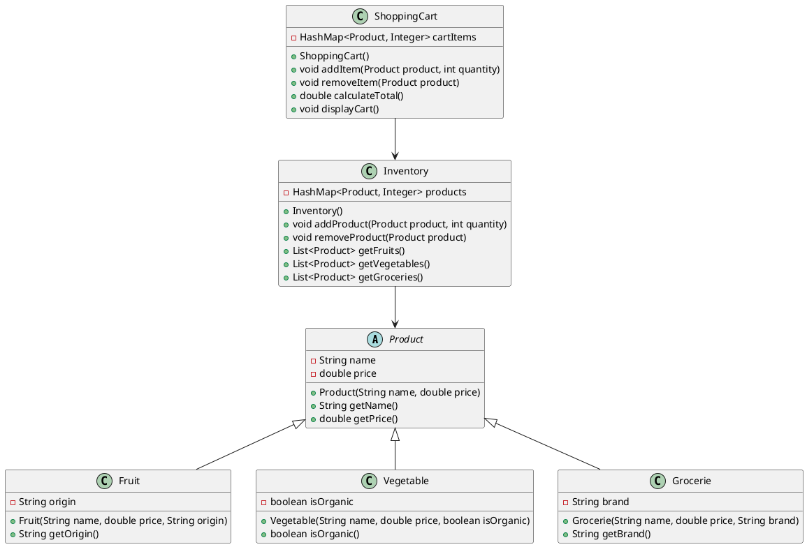

# Ejemplo 9: Carrito de Compras con HashMap en Java

En este ejemplo, crearemos una aplicación simple de carrito de compras utilizando la clase `HashMap` en Java. El carrito
permitirá agregar productos, eliminar productos y mostrar el contenido del carrito junto con el total a pagar.

## Clases

