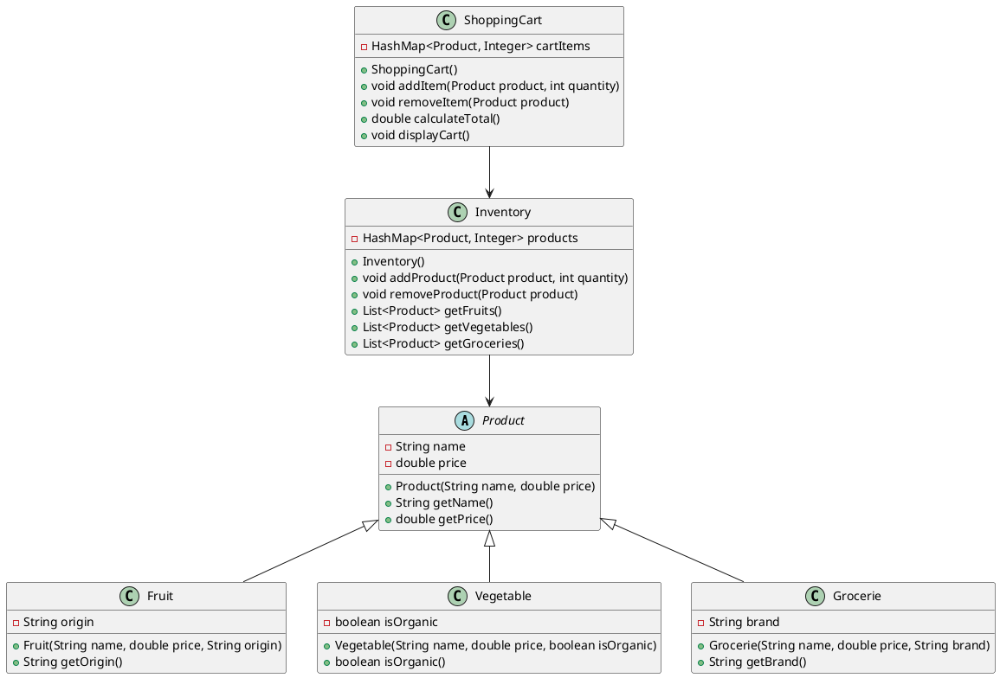

# Ejemplo 9: Carrito de Compras con HashMap en Java

En este ejemplo, crearemos una aplicación simple de carrito de compras utilizando la clase `HashMap` en Java. El carrito
permitirá agregar productos, eliminar productos y mostrar el contenido del carrito junto con el total a pagar.

## Clases



## Código Java

### Clase Product y sus subclases

```java
public abstract class Product {
    private String name;
    private double price;

    public Product(String name, double price) {
        this.name = name;
        this.price = price;
    }

    public String getName() {
        return name;
    }

    public double getPrice() {
        return price;
    }
}
```

```java
public class Fruit extends Product {
    private String origin;

    public Fruit(String name, double price, String origin) {
        super(name, price);
        this.origin = origin;
    }

    public String getOrigin() {
        return origin;
    }
}
```

```java
public class Vegetable extends Product {
    private boolean isOrganic;

    public Vegetable(String name, double price, boolean isOrganic) {
        super(name, price);
        this.isOrganic = isOrganic;
    }

    public boolean isOrganic() {
        return isOrganic;
    }
}
```

```java
public class Grocerie extends Product {
    private String brand;

    public Grocerie(String name, double price, String brand) {
        super(name, price);
        this.brand = brand;
    }

    public String getBrand() {
        return brand;
    }
}
```

### Clase Inventory

```java
import java.util.HashMap;
import java.util.List;
import java.util.ArrayList;

public class Inventory {
    private HashMap<Product, Integer> products;

    public Inventory() {
        products = new HashMap<>();
    }

    public void addProduct(Product product, int quantity) {
        products.put(product, quantity);
    }

    public void removeProduct(Product product) {
        products.remove(product);
    }

    public <T> List<T> getProductsByType(Class<T> type) {
        List<T> result = new ArrayList<>();
        for (Product product : products.keySet()) {
            if (type.isInstance(product)) {
                result.add(type.cast(product));
            }
        }
        return result;
    }
}
```

### Clase ShoppingCart

```java
import java.util.HashMap;
import java.util.Map;
import java.util.List;

public class ShoppingCart {
    private HashMap<Product, Integer> cartItems;

    public ShoppingCart() {
        cartItems = new HashMap<>();
    }

    public void addItem(Product product, int quantity) {
        cartItems.put(product, cartItems.getOrDefault(product, 0) + quantity);
    }

    public void removeItem(Product product) {
        cartItems.remove(product);
    }

    public double calculateTotal() {
        double total = 0.0;
        for (Map.Entry<Product, Integer> entry : cartItems.entrySet()) {
            total += entry.getKey().getPrice() * entry.getValue();
        }
        return total;
    }

    public void displayCart() {
        System.out.println("Carrito de Compras:");
        for (Map.Entry<Product, Integer> entry : cartItems.entrySet()) {
            System.out.println(entry.getKey().getName() + " - Cantidad: " + entry.getValue() + " - Precio Unitario: $" + entry.getKey().getPrice());
        }
        System.out.println("Total a Pagar: $" + calculateTotal());
    }
}
```

### Clase Main

```java
public class Main {
    public static void main(String[] args) {
        Inventory inventory = new Inventory();
        inventory.addProduct(new Fruit("Manzana", 0.5, "Chile"), 100);
        inventory.addProduct(new Vegetable("Zanahoria", 0.3, true), 200);
        inventory.addProduct(new Grocerie("Arroz", 1.0, "MarcaX"), 150);

        ShoppingCart cart = new ShoppingCart();
        cart.addItem(new Fruit("Manzana", 0.5, "Chile"), 4);
        cart.addItem(new Vegetable("Zanahoria", 0.3, true), 5);
        cart.addItem(new Grocerie("Arroz", 1.0, "MarcaX"), 2);

        cart.displayCart();
    }
}
```

## Explicación

En este ejemplo, hemos creado una aplicación de carrito de compras utilizando `HashMap` para almacenar los productos en
el inventario y los artículos en el carrito. Cada producto tiene un nombre y un precio, y las subclases `Fruit`,
`Vegetable` y `Grocerie` agregan atributos específicos.

La clase `Inventory` gestiona los productos disponibles, mientras que la clase `ShoppingCart` permite agregar y eliminar
artículos, calcular el total y mostrar el contenido del carrito. En la clase `Main`, se demuestra cómo utilizar estas
clases para simular una experiencia de compra simple.