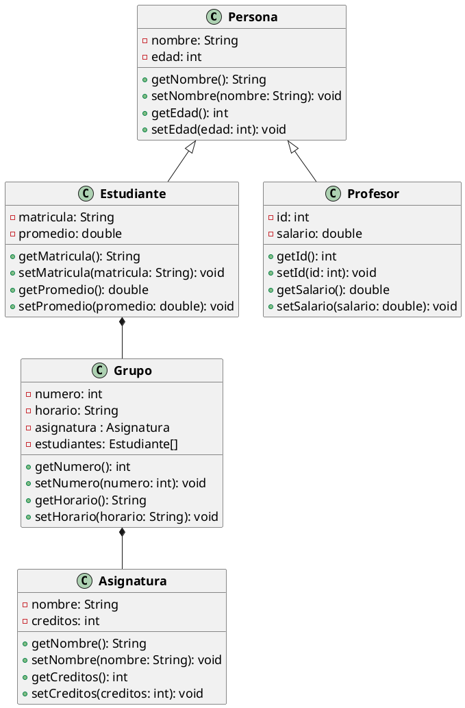

# Ejemplo de Diagrama de Clases

En este ejemplo se muestra cómo se puede representar un diagrama de clases en Java utilizando PlantUML. En el diagrama
se muestra la relación entre las clases `Persona`, `Estudiante`, `Profesor`, `Asignatura` y `Grupo`.

## Diagrama de Clases en formato de texto

```text
@startuml
skinparam class{
    AttributeFontSize 18
    FontStyle bold
}
class Persona {
    - nombre: String
    - edad: int
    + getNombre(): String
    + setNombre(nombre: String): void
    + getEdad(): int
    + setEdad(edad: int): void
}
class Estudiante {
    - matricula: String
    - promedio: double
    + getMatricula(): String
    + setMatricula(matricula: String): void
    + getPromedio(): double
    + setPromedio(promedio: double): void
}
class Profesor {
    - id: int
    - salario: double
    + getId(): int
    + setId(id: int): void
    + getSalario(): double
    + setSalario(salario: double): void
}
class Asignatura {
    - nombre: String
    - creditos: int
    + getNombre(): String
    + setNombre(nombre: String): void
    + getCreditos(): int
    + setCreditos(creditos: int): void
}
class Grupo {
    - numero: int
    - horario: String
    - asignatura : Asignatura
    - estudiantes: Estudiante[]
    + getNumero(): int
    + setNumero(numero: int): void
    + getHorario(): String
    + setHorario(horario: String): void
}
Persona <|-- Estudiante
Persona <|-- Profesor
Estudiante *-- Grupo
Grupo *-- Asignatura
@enduml
```

## Diagrama de Clases en formato PlantUML



En el ejemplo anterior, se muestra la representación de varias clases en un diagrama de clases. Cada clase tiene sus
atributos y métodos correspondientes, y se muestra la relación entre las clases utilizando las flechas correspondientes.

Este tipo de diagramas es útil para visualizar la estructura de un sistema o aplicación, así como las relaciones entre
las diferentes clases y objetos que lo componen. Además, permite identificar de manera clara y concisa la jerarquía y
dependencias entre las clases, lo que facilita el diseño y la implementación del software.

Los diagramas de clases son una herramienta fundamental en el diseño orientado a objetos, ya que permiten representar de
manera visual y estructurada la arquitectura de un sistema, lo que facilita su comprensión y mantenimiento a lo largo
del tiempo.