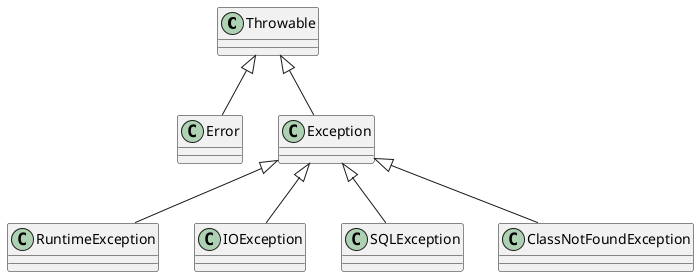

# ¿Qué es una excepción?

Una excepción es un evento que ocurre durante la ejecución de un programa y que interrumpe el flujo normal de ejecución.
Las excepciones pueden ser causadas por errores en el código, como una división por cero, un acceso a un índice fuera de
los límites de un arreglo, o una operación de entrada/salida fallida. También pueden ser causadas por condiciones
externas, como la falta de memoria o la pérdida de conexión a una base de datos.

Las excepciones en Java son objetos que representan un error o una condición anormal que ha ocurrido durante la
ejecución de un programa. Cuando una excepción se lanza, el flujo de ejecución del programa se interrumpe y se busca un
manejador de excepciones que pueda manejar la excepción. Si no se encuentra un manejador de excepciones adecuado, el
programa se detiene y se muestra un mensaje de error en la consola.

Las excepciones en Java se dividen en dos categorías principales: excepciones comprobadas y excepciones no comprobadas.

## Jerarquía de excepciones en Java

En Java, todas las excepciones son subclases de la clase `Throwable`. La clase `Throwable` tiene dos subclases
principales: `Error` y `Exception`. La clase `Error` representa errores graves que no se pueden manejar, como la falta
de memoria o la pérdida de conexión a una base de datos. La clase `Exception` representa excepciones que pueden ser
manejadas en el código.

La clase `Exception` tiene varias subclases, como `RuntimeException`, `IOException`, `SQLException`, etc. Las
excepciones de tipo `RuntimeException` son excepciones no comprobadas, mientras que las excepciones de tipo
`IOException`, `SQLException`, etc., son excepciones comprobadas.

## Excepciones comprobadas

Las excepciones comprobadas son excepciones que el compilador obliga a manejar o declarar en el código. Estas
excepciones son subclases de `Exception` pero no de `RuntimeException`. Algunos ejemplos de excepciones comprobadas son
`IOException`, `SQLException` y `ClassNotFoundException`.

Para manejar una excepción comprobada, se debe utilizar un bloque `try-catch` o declarar la excepción en la firma del
método. Un bloque `try-catch` se utiliza para envolver el código que puede lanzar una excepción y manejarla en caso de
que ocurra. Si una excepción comprobada no se maneja adecuadamente, el código no compilará.

## Excepciones no comprobadas

Las excepciones no comprobadas son excepciones que el compilador no obliga a manejar o declarar en el código. Estas
excepciones son subclases de `RuntimeException`. Algunos ejemplos de excepciones no comprobadas son
`ArithmeticException`,
`NullPointerException` y `ArrayIndexOutOfBoundsException`.

A diferencia de las excepciones comprobadas, las excepciones no comprobadas no requieren un bloque `try-catch` o una
declaración de excepción en la firma del método. Sin embargo, es una buena práctica manejar las excepciones no
comprobadas para evitar que el programa se detenga inesperadamente.