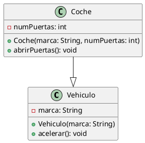

# ¿Qué es la herencia?

## Introducción

La herencia es un concepto fundamental en la programación orientada a objetos. En Java, la herencia permite a una clase
heredar los atributos y métodos de otra clase. Esto permite la reutilización de código y la creación de jerarquías de
clases.

## ¿Qué es la herencia?

La herencia es un mecanismo en el que una clase (clase hija) hereda los atributos y métodos de otra clase (clase padre).
La clase hija puede acceder a los atributos y métodos de la clase padre y también puede añadir nuevos atributos y
métodos propios.

En Java, la herencia se logra mediante la palabra clave `extends`. Al heredar de una clase, una clase hija puede acceder
a los atributos y métodos de la clase padre, siempre y cuando sean `public` o `protected`.

## ¿Qué es una superclase y una subclase?

En el contexto de la herencia, la clase de la que se hereda se conoce como **superclase** o **clase padre**, y la clase
que hereda se conoce como **subclase** o **clase hija**. La superclase proporciona los atributos y métodos que la
subclase hereda y puede añadir nuevos atributos y métodos propios.

## Sintaxis

La sintaxis para definir una clase que hereda de otra clase en Java es la siguiente:

```java
public class ClaseHija extends ClasePadre {
    // Cuerpo de la clase
}
```

En este ejemplo, `ClaseHija` hereda de `ClasePadre`. La clase hija puede acceder a los atributos y métodos de la clase
padre siempre y cuando sean `public` o `protected`. Si un atributo o método es `private`, no se puede acceder a él desde
la clase hija. Sin embargo, si la clase padre tiene métodos `public` o `protected` que acceden a los atributos privados,
la clase hija puede acceder a esos atributos a través de esos métodos.

## Ejemplo

Supongamos que tenemos una clase `Vehiculo` que tiene un atributo `marca` y un método `acelerar`. Podemos definir una
clase `Coche` que hereda de `Vehiculo` de la siguiente manera:

### Diagrama de clases



En este caso el triángulo indica la herencia, apuntando el mismo hacia la clase padre, en este caso `Vehiculo`.

### Código

#### Vehiculo.java

```java
public class Vehiculo {
    protected String marca;

    public Vehiculo(String marca) {
        this.marca = marca;
    }

    public void acelerar() {
        System.out.println("Acelerando...");
    }
}
```

#### Coche.java

```java
public class Coche extends Vehiculo {
    private int numPuertas;

    public Coche(String marca, int numPuertas) {
        super(marca);
        this.numPuertas = numPuertas;
    }

    public void abrirPuertas() {
        System.out.println("Abriendo puertas...");
    }
}
```

En este ejemplo, la clase `Coche` hereda de la clase `Vehiculo` y añade un atributo `numPuertas` y un método
`abrirPuertas`.

Entonces:

* ¿Cuántos atributos tiene la clase `Vehiculo`?
    * Un atributo: `marca`.
    * El atributo `marca` es `protected`, por lo que las clases hijas pueden acceder a él.
* ¿Cuántos métodos tiene la clase `Vehiculo`?
    * Cuenta con un método: `acelerar`.
    * El método `acelerar` es `public`, por lo que las clases hijas pueden acceder a él.
* ¿Cuántos atributos tiene la clase `Coche`?
    * Tiene dos atributos: `marca` y `numPuertas`.
    * El atributo `marca` es heredado de la clase `Vehiculo`.
* ¿Cuántos métodos tiene la clase `Coche`?
    * Cuenta con dos métodos: `abrirPuertas` y `acelerar`.
    * El método `acelerar` es heredado de la clase `Vehiculo`.

## Conclusión

La herencia es un concepto poderoso en la programación orientada a objetos que permite la reutilización de código y la
creación de jerarquías de clases. En Java, la herencia se logra mediante la palabra clave `extends`. Al heredar de una
clase, una clase hija puede acceder a los atributos y métodos de la clase padre, siempre y cuando sean `public` o
`protected`.