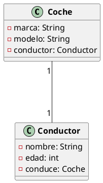
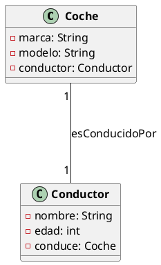
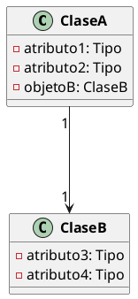
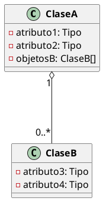
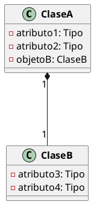
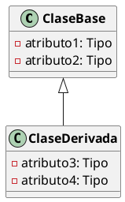

# Tipos de Relaciones en Diagramas de Clases

Los diagramas de clases son una herramienta visual utilizada en el diseño de sistemas orientados a objetos para
representar la estructura y las relaciones entre las clases que componen un sistema. Estos diagramas muestran las
clases, sus atributos, métodos y las relaciones entre ellas, permitiendo visualizar de forma clara y concisa la
arquitectura de un sistema.

## Tipos de Relaciones

En un diagrama de clases, las relaciones entre las clases pueden ser de diferentes tipos, dependiendo de la naturaleza
de la interacción entre las clases. Algunos de los tipos de relaciones más comunes son:

### 1. Asociación

Índica que una propiedad de una clase contiene una referencia a una instancia (o instancias) de otra clase.

La asociación es la relación más utilizada entre una clase y otra clase, lo que significa que existe una conexión entre
un tipo de objeto y otro tipo de objeto. Las combinaciones y agregaciones también pertenecen a las relaciones
asociativas, pero las relaciones entre clases de afiliaciones son más débiles que las otras dos.

Hay cuatro tipos de asociaciones:

- **Asociación Unidireccional**: Una clase contiene una referencia a otra clase, pero la otra clase no contiene una
  referencia a la primera clase.
- **Asociación Bidireccional**: Ambas clases contienen referencias a la otra clase.
- **Autoasociación**: Una clase contiene una referencia a sí misma.
- **Asociación de Números Múltiples**: Una clase contiene múltiples referencias a otra clase.

Por ejemplo: coches y conductores, un coche corresponde a un conductor en particular y un conductor puede conducir
varios coches.

Lo que quiere decir que un coche cuenta con un atributo conductor y un conductor cuenta con un atributo coche.

> **Nota**: De igual manera, podemos nombrar las relaciones entre clases, por ejemplo, si un coche es conducido por un
> conductor, podemos nombrar la relación como `esConducidoPor`.

### Unidireccional

La relación unidireccional es una relación entre dos clases en la que una clase conoce a la otra, pero la otra clase no
necesariamente conoce a la primera.

Vea el siguiente ejemplo:

En este caso, la clase `ClaseA` conoce a la clase `ClaseB`, pero la clase `ClaseB` no necesariamente conoce a la clase
`ClaseA`. Esto lo podemos notar en el atributo `objetoB` de la clase `ClaseA`, que es una referencia a un objeto de la
clase `ClaseB`.

## 2. Agregación

La agregación es una relación entre dos clases en la que una clase es parte de otra clase. La agregación es una relación
más débil que la composición, ya que la clase que forma parte de otra clase puede existir de forma independiente.

Veamos el siguiente ejemplo:

En este caso, la clase `ClaseA` contiene una lista de objetos de la clase `ClaseB`, lo que indica una relación de
agregación entre ambas clases. La clase `ClaseB` puede existir de forma independiente y ser parte de múltiples
instancias de la clase `ClaseA`.

## 3. Composición

La composición es una relación entre dos clases en la que una clase es parte de otra clase y no puede existir de forma
independiente. La composición es una relación más fuerte que la agregación, ya que la clase que forma parte de otra
clase no puede existir sin la clase principal.

Veamos el siguiente ejemplo:

En este caso, la clase `ClaseA` contiene un objeto de la clase `ClaseB`, lo que índica una relación de composición entre
ambas clases. La clase `ClaseB` no puede existir de forma independiente y es parte de una única instancia de la clase
`ClaseA`.

## 4. Herencia

La herencia es una relación entre dos clases en la que una clase hereda los atributos y métodos de otra clase. La clase
que hereda se conoce como subclase o clase derivada, y la clase de la que hereda se conoce como superclase o clase base.

Veamos el siguiente ejemplo:

En este caso, la clase `ClaseDerivada` hereda los atributos de la clase `ClaseBase`, lo que índica una relación de
herencia entre ambas clases. La clase `ClaseDerivada` puede acceder a los atributos y métodos de la clase `ClaseBase` y
además puede agregar sus propios atributos y métodos.

## Conclusión

Los diagramas de clases son una herramienta poderosa para representar la estructura y las relaciones entre las clases
de un sistema. Conocer los diferentes tipos de relaciones entre las clases y cómo representarlas de forma visual en un
diagrama de clases es fundamental para el diseño y la comprensión de la arquitectura de un sistema orientado a objetos.