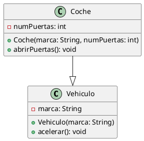
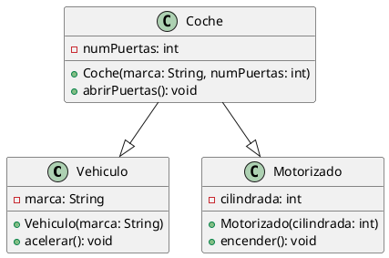
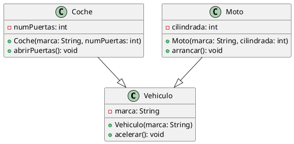
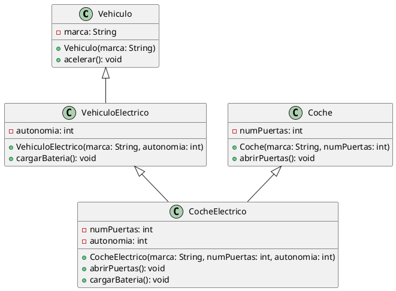
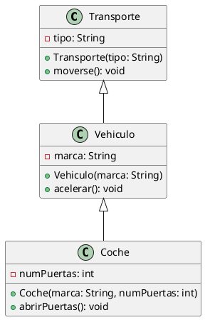

# Tipos de Herencia

## Introducción

La herencia como hemos visto, es un concepto fundamental en la programación orientada a objetos. En Java, la herencia
permite a una clase heredar los atributos y métodos de otra clase. Sin embargo, no todas las clases son iguales y la
herencia puede tomar diferentes formas. En este artículo, exploraremos los diferentes tipos de herencia en Java y cómo
se pueden utilizar en la práctica.

## Tipos de Herencia

### Herencia Simple

La herencia simple es el tipo más común de herencia en Java. En este tipo de herencia, una clase puede heredar de una
sola clase padre. Por ejemplo, si tenemos una clase `Coche` que hereda de la clase `Vehiculo`, estamos utilizando
herencia simple.

En este caso, la clase `Coche` hereda de la clase `Vehiculo`, lo que significa que `Coche` tiene acceso a los atributos
y métodos de `Vehiculo`.

### Herencia Múltiple

La herencia múltiple es un concepto que permite a una clase heredar de más de una clase padre. Java no soporta la
herencia múltiple directamente, sin embargo, hay otros lenguajes de programación como C++ que sí lo permiten.

En este caso, la clase `Coche` hereda de las clases `Vehiculo` y `Motorizado`, lo que significa que `Coche` tiene acceso
a los atributos y métodos de ambas clases.

> Ten en cuenta que esto no se puede hacer directamente en Java.
> {style="warning"}

### Herencia Jerárquica

La herencia jerárquica es un concepto en el que una clase padre tiene más de una clase hija. Por ejemplo, si tenemos
una clase `Vehiculo` con dos clases hijas `Coche` y `Moto`, estamos utilizando herencia jerárquica.

En este caso, la clase `Coche` y la clase `Moto` heredan de la clase `Vehiculo`, lo que significa que ambas clases
tienen acceso a los atributos y métodos de `Vehiculo`. Sin embargo, `Coche` y `Moto` son clases independientes y no
tienen relación directa entre sí.

### Herencia Híbrida

La herencia híbrida es un concepto en el que se combinan diferentes tipos de herencia. Por ejemplo, si tenemos una clase
`CocheElectrico` que hereda de la clase `Coche` y de la clase `VehiculoElectrico`, estamos utilizando herencia híbrida.

En este caso, la clase `CocheElectrico` hereda de las clases `Coche` y `VehiculoElectrico`, lo que significa que
`CocheElectrico` tiene acceso a los atributos y métodos de ambas clases.

### Herencia Multinivel

La herencia multinivel es un concepto en el que una clase hereda de otra clase que a su vez hereda de otra clase. Por
ejemplo, si tenemos una clase `Vehiculo` que hereda de la clase `Transporte` y una clase `Coche` que hereda de la clase
`Vehiculo`, estamos utilizando herencia multinivel.

En este caso, la clase `Vehiculo` hereda de la clase `Transporte` y la clase `Coche` hereda de la clase `Vehiculo`, lo
que significa que `Coche` tiene acceso a los atributos y métodos de ambas clases, pero no directamente a los atributos y
métodos de `Transporte`, solo a través de `Vehiculo`, ya que es esta clase la que hereda de `Transporte`.

## Conclusión

La herencia es un concepto poderoso en la programación orientada a objetos que nos permite reutilizar código y crear
jerarquías de clases. En Java, existen diferentes tipos de herencia que nos permiten modelar de manera efectiva las
relaciones entre las clases. Al comprender los diferentes tipos de herencia y cómo se pueden utilizar en la práctica,
podemos escribir código más limpio, eficiente y fácil de mantener.