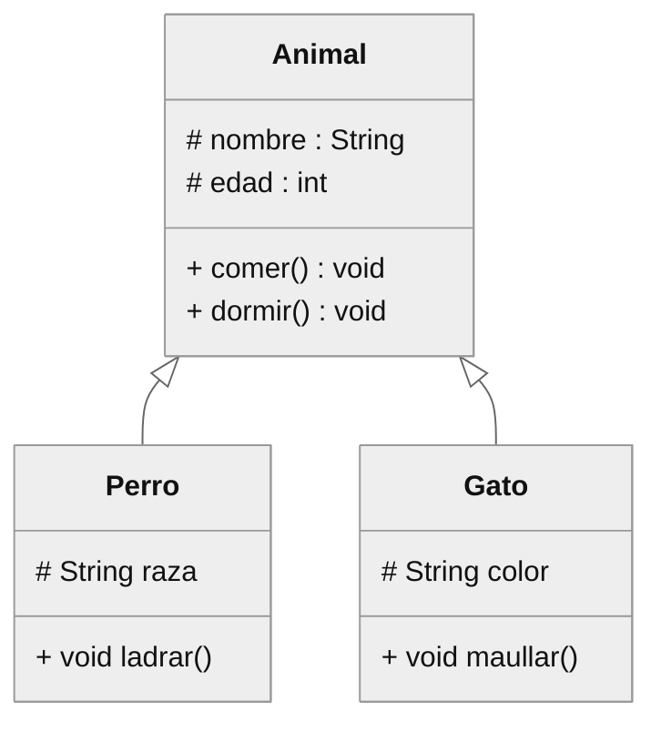

```mermaid
---
config:
  theme: 'neutral'
---
classDiagram
    class Animal {
        # nombre : String
        # edad : int
        + comer() void
        + dormir() void
    }

    class Perro  {
        # String raza
        + void ladrar()
    }

    class Gato {
        # String color
        + void maullar()
    }

    Animal <|-- Perro
    Animal <|-- Gato
```